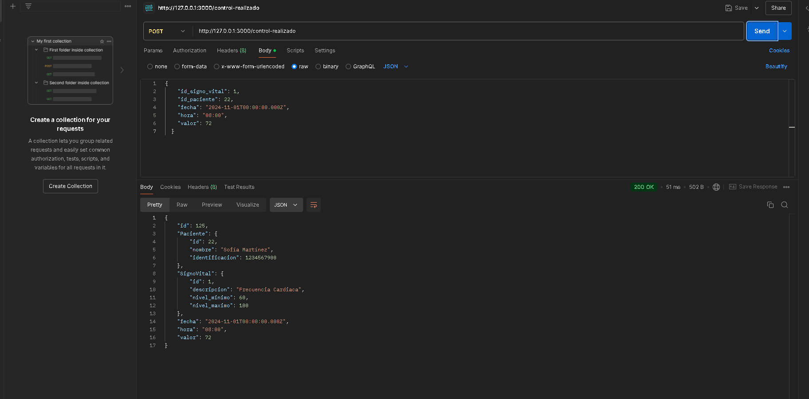

Configuración de la base de datos MYSQL con Sequelize como ORM

Se cambio la url de conexion para que sea compatible con MYSQL
Se creo la conexión a la base de datos MySQL utilizando Sequelize
Se creo los modelos y se cambio los metodos de consultas a los compatibles con sequelize

Rutas

-GET pacientes

-POST pacientes 

GET signos vitales

POST signos vitales

-GET control realizado

-POST control realizado 

