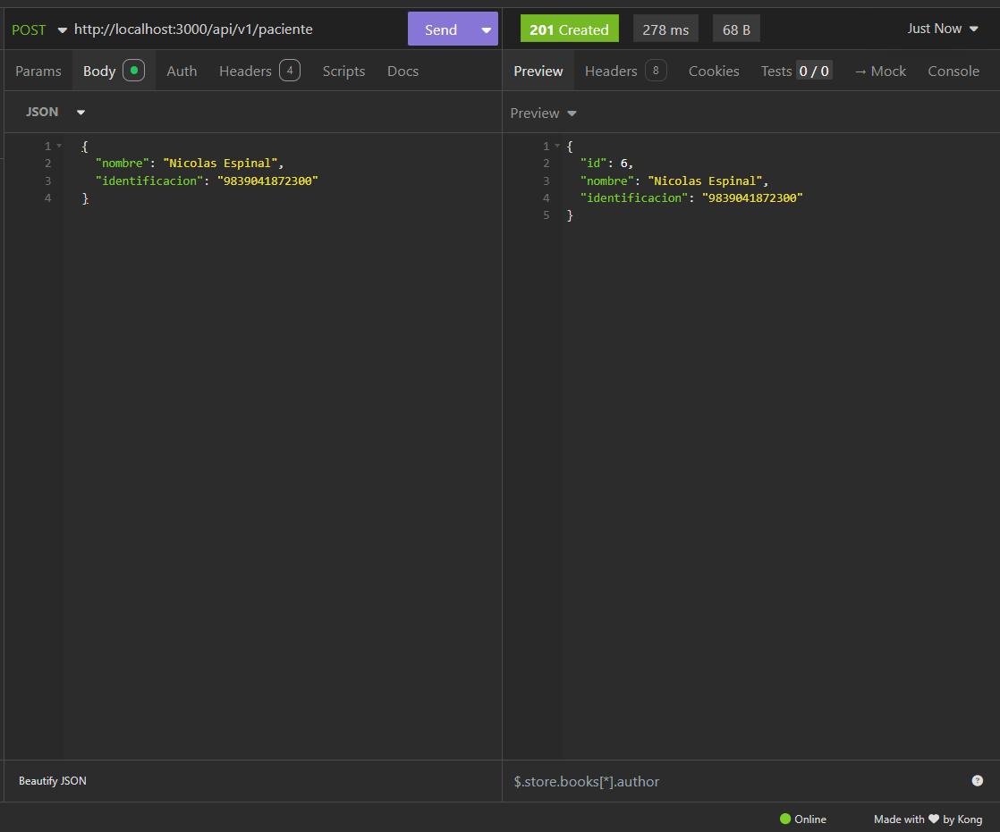
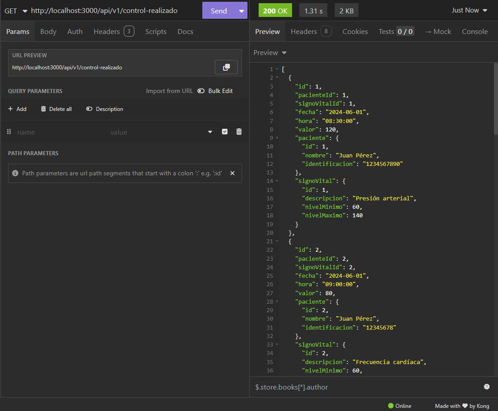
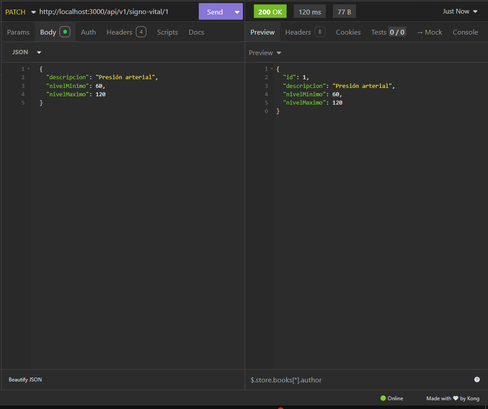

### Pasos para inicializar el servido 🚀🚀

## ⬇⬇ Instalacion de dependencias ⬇⬇
npm install 

## ⬇⬇ Instala Driver bas  de datos ⬇⬇
npm i pg

## Inicializa servidor 🌐 
npm run start:dev

## Evidencias 🧾🧾
--
## POST Pacientes

## GET Control Realizados

## Patch Signos Vitales
