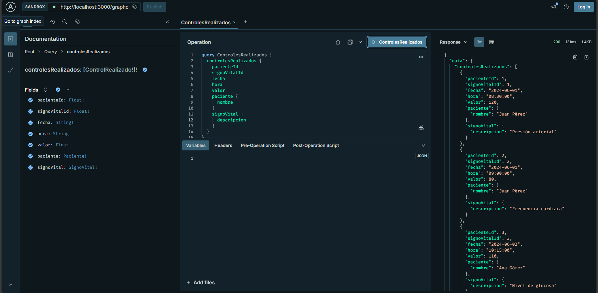
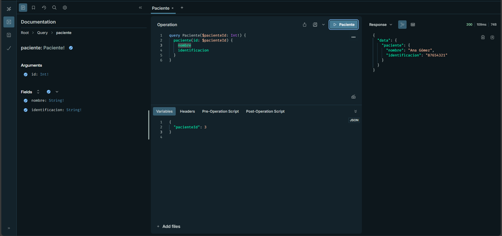
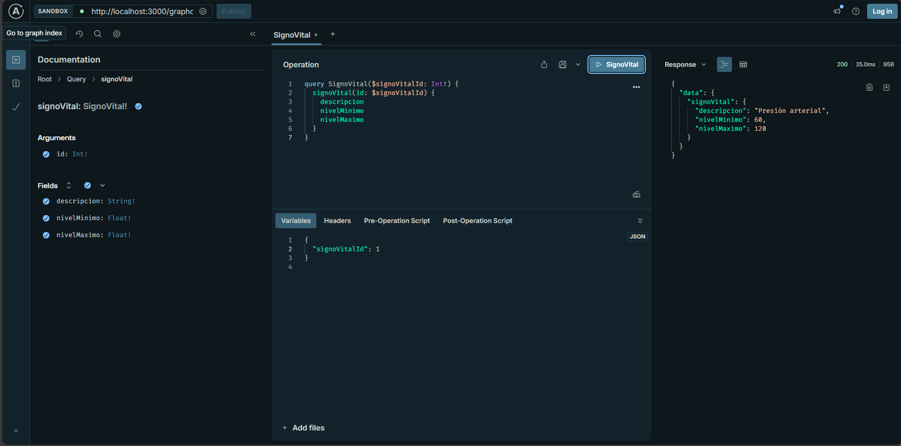

### Pasos para inicializar el servido 🚀🚀

## ⬇⬇ Instalacion de dependencias ⬇⬇
npm install 

## ⬇⬇ Instala Driver bas  de datos ⬇⬇
npm i pg

## Inicializa servidor 🌐 
npm run start:dev

## Evidencias 🧾🧾

## Query control realizados

--
## Query pacientes

-- 
## Query signo vital

--
## Mutation control realizado

--
## Mutation paciente

--
## Mutation signo vital
