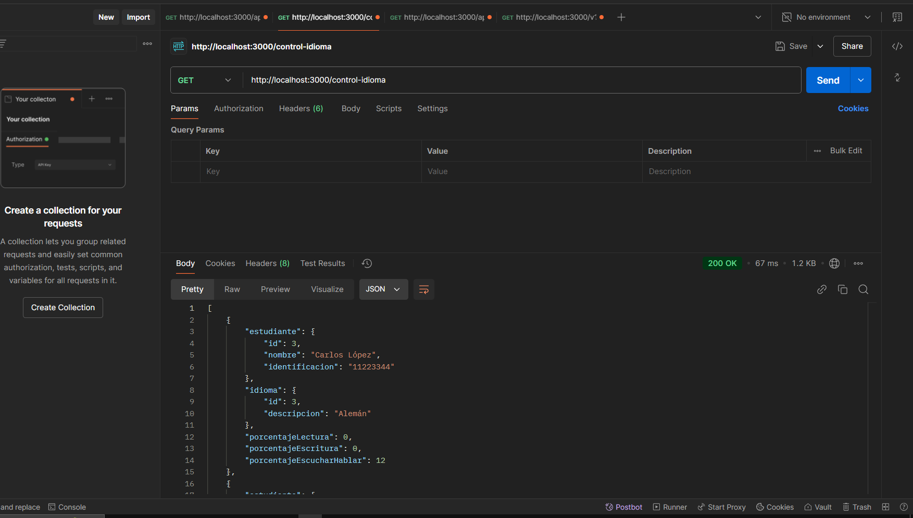
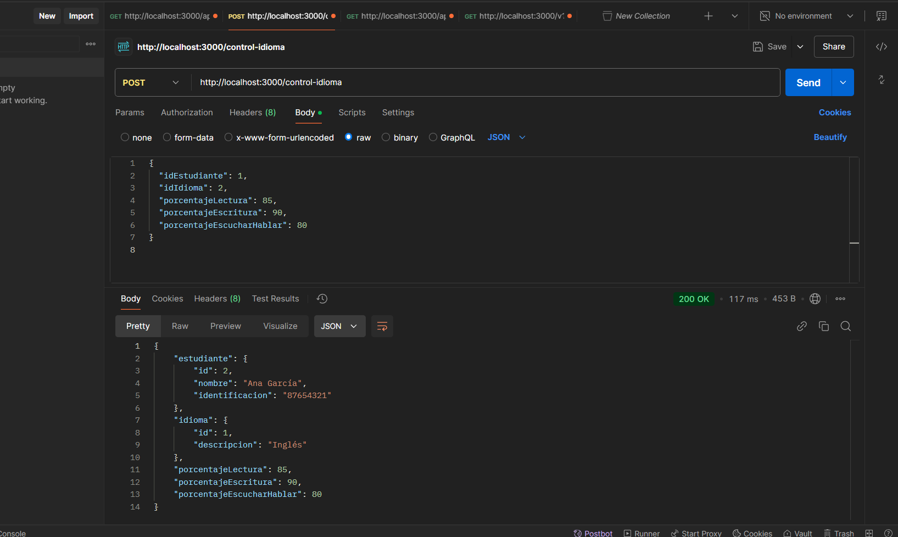

1. Instalación de Dependencias
npm install typeorm mysql2
npm install reflect-metadata
mysql2 

2. Configurar Variables de Entorno
Tu archivo .env seguirá siendo el mismo para configurar las variables relacionadas con la base de datos:

-- env
Port=3000
URL_DATABASE=mysql://root@localhost:3306/control_idioma

3. Inicializa servidor
npm run dev

## Evidencia 
--

## Get

## Post
