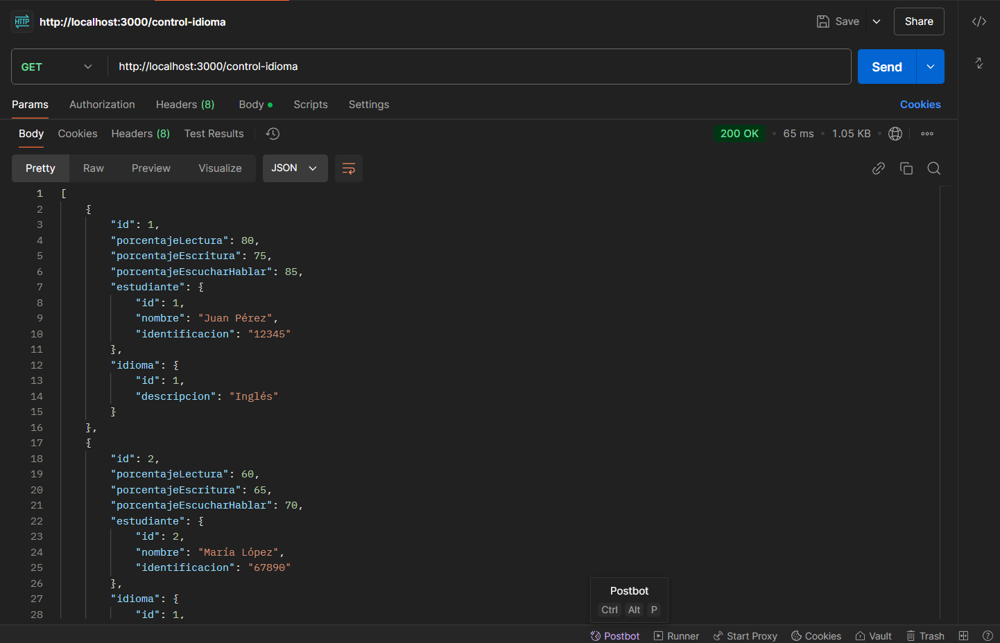
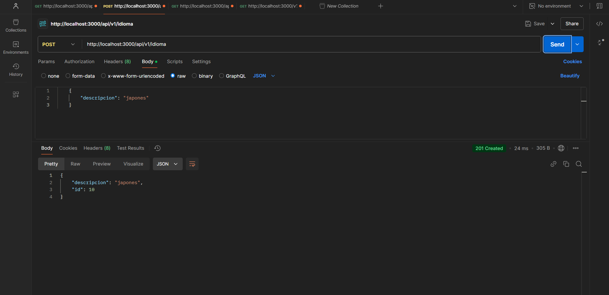
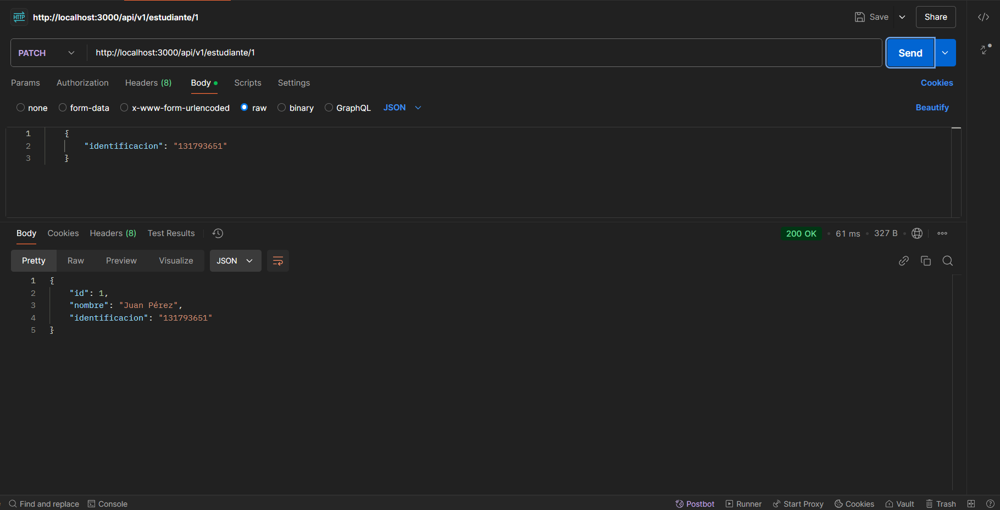

Guia para levantar proyecto 

## instalacion de dependencias
npm install mysql2
--
npm install 

## inicializa el servidor 
npm run start:dev

-- Funcionamiento

--Get control idiomas

--Post idioma

--Patch estudiante
