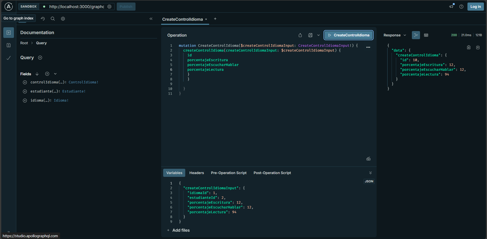

Guia para levantar proyecto 

-- Instalacion de dependencias
npm install mysql2
npm install 

-- Inicializa el servidor 
npm run start:dev

--configuracion .env

DB_HOST=localhost
DB_PORT=3306
DB_USERNAME=root
DB_PASSWORD=
DB_NAME=idiomas

--Mutation Control idioma

-- 

--Mutation Estudiante 

--

--Mutation idioma

--

--Query idioma

--

--Query Control idioma

--

--Query Estudiante
