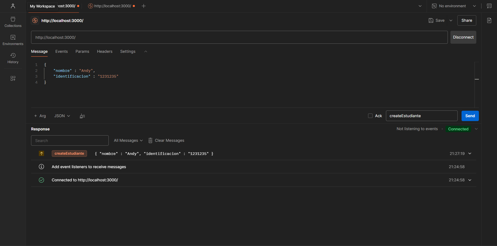
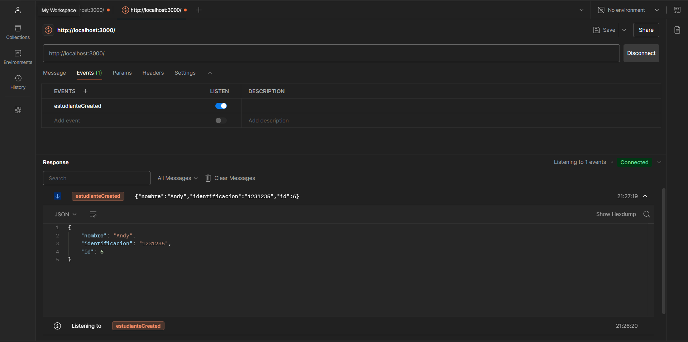
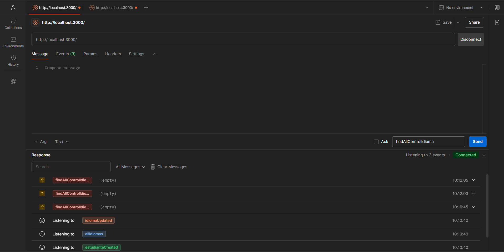
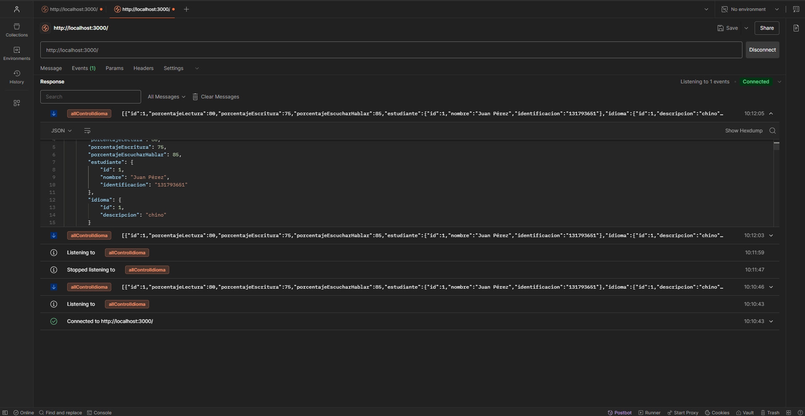
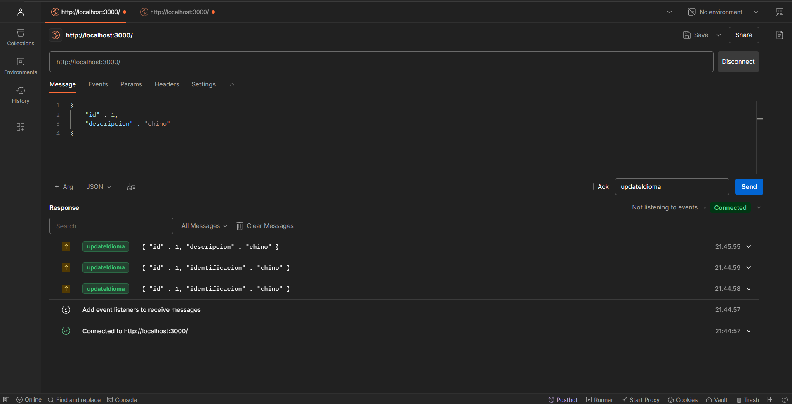
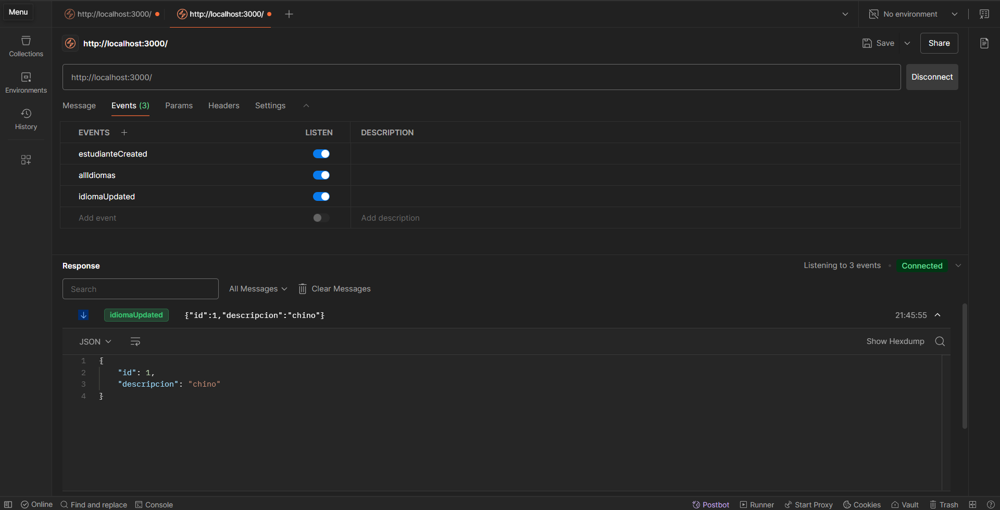

Guia para levantar proyecto 

-- Instalacion de dependencias
npm install mysql2
npm install 

-- Inicializa el servidor 
npm run start:dev

-- Configuracion .env

DB_HOST=localhost
DB_PORT=3306
DB_USERNAME=root
DB_PASSWORD=
DB_NAME=idiomas

--Alumno emit 

--Alumno menssage

--Control Idioma emit

--Control idioma menssage

--Idioma emit

--Idioma menssage

