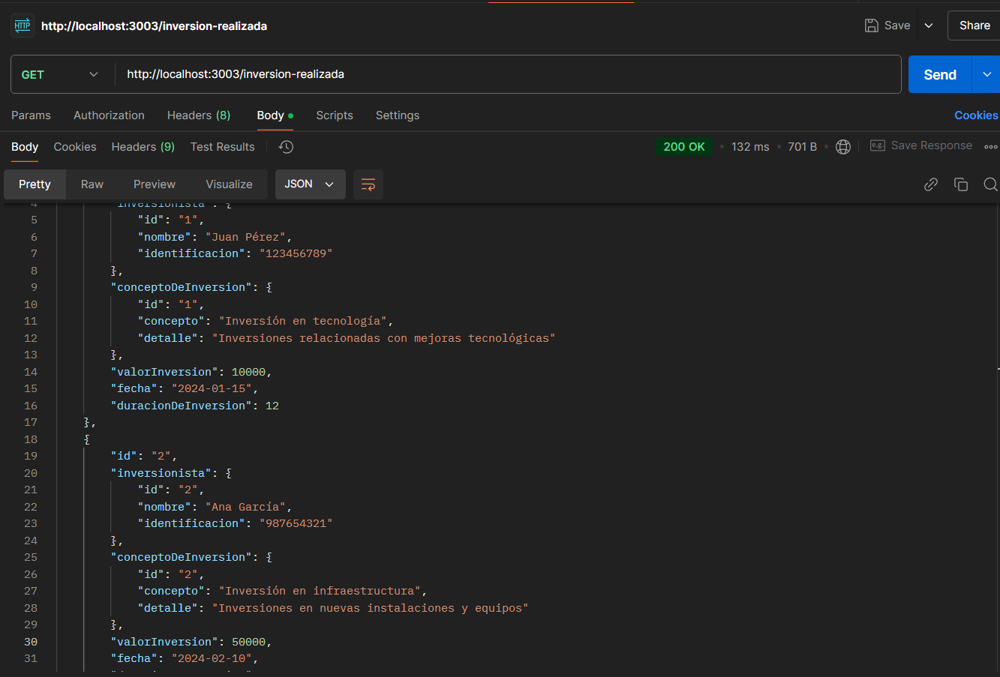
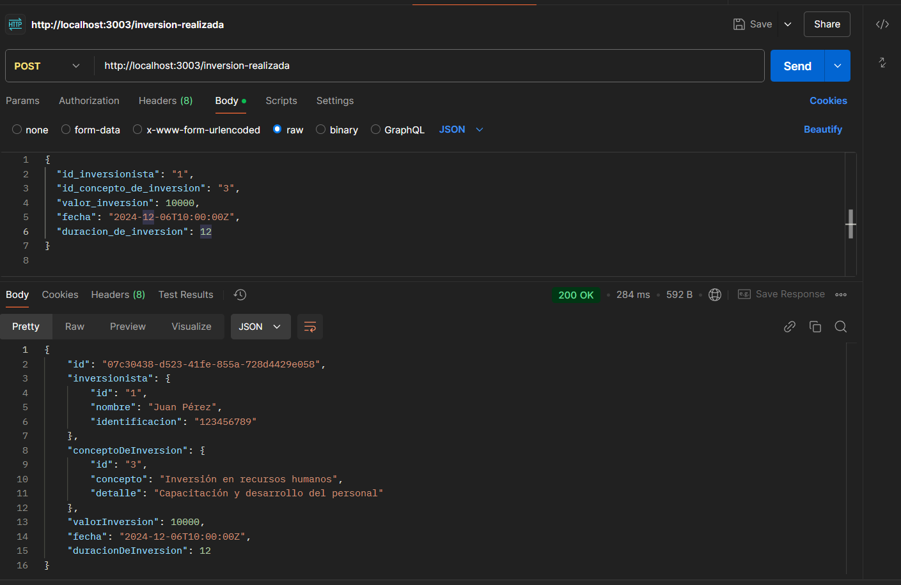

# Proyecto API con TypeORM y PostgreSQL

## Descripción
Este proyecto ha sido modificado para cambiar la conexión a la base de datos de MongoDB (usando Mongoose) a PostgreSQL utilizando TypeORM.

## Pasos para el Cambio:

### 1. Instalación de dependencias
Se instalaron las siguientes dependencias:
- `typeorm`: ORM para trabajar con bases de datos SQL.
- `pg`: Driver de PostgreSQL para Node.js.
- `reflect-metadata`: Necesario para la funcionalidad de TypeORM.

### 2. Configuración de TypeORM
En el archivo `typeorm/datasources.ts`, se configuró la conexión a la base de datos PostgreSQL.

### Imágenes:

1. **Prueba con GET:**

2. **Prueba con POST:**
